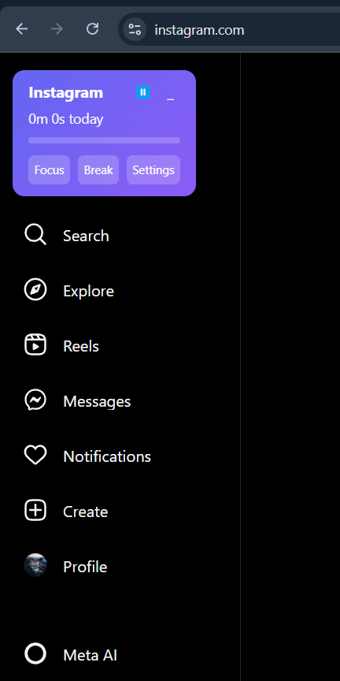
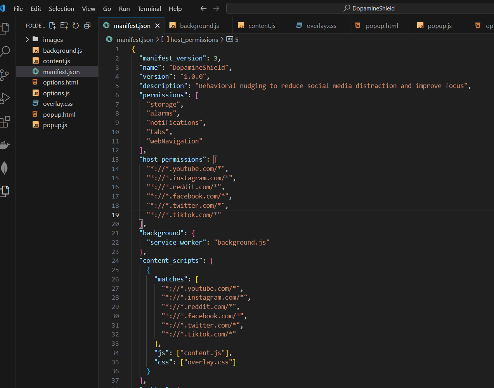
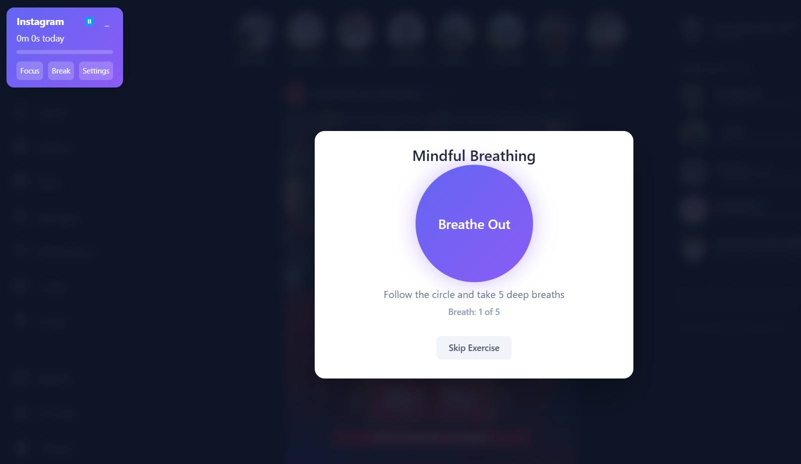
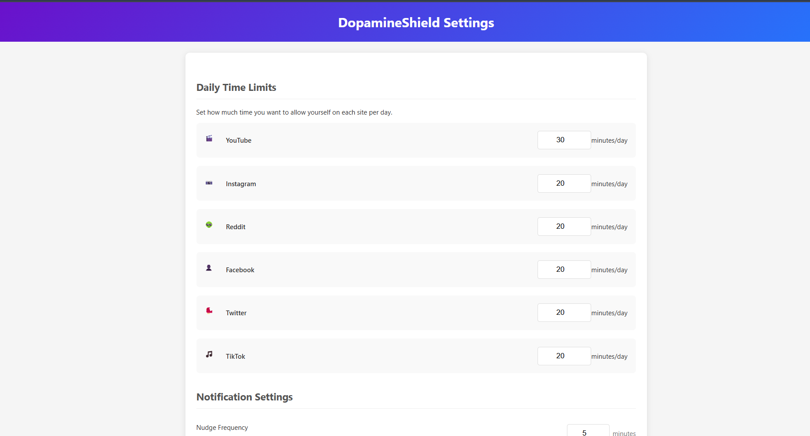
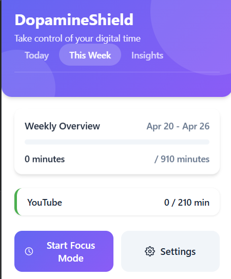
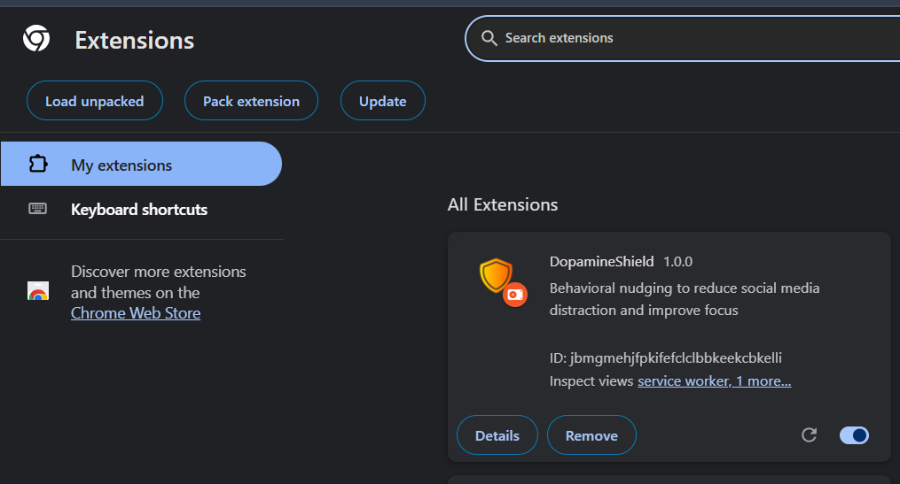
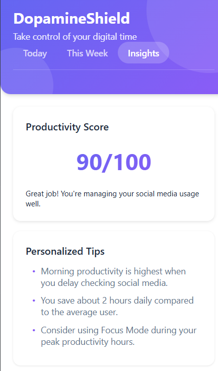

# 🧘‍♂️ ZenWall – Chrome Extension for Focus & Productivity

**ZenWall** is your ultimate digital guardian that helps you stay focused by blocking distracting websites, running productive focus sessions, and tracking your screen time—beautifully and effortlessly.

---

## 🚀 Features

- 🔒 **Website Blocker** – Block time-draining websites like YouTube, Instagram, Twitter, and more.
- ⏳ **Movable Focus Timer** – Start a session and keep the floating timer window where you like.
- 🎯 **Focus Sessions (Pomodoro Mode)** – Stay disciplined with structured work/break cycles.
- ⚙️ **Custom Settings** – Personalize blocked sites, timer durations, and UI preferences.
- 📊 _(Coming Soon)_ **Productivity Stats Dashboard**

---

## 🛠️ Tech Stack

- HTML, CSS, JavaScript
- Chrome Extension APIs
- Modular UI components

---

## 📸 Screenshots

### ⏱️ Focus Timer Overlay on Instagram



### 📂 manifest.json Configuration



### 🧘 Mindful Breathing Prompt



### ⚙️ Daily Limit Settings



### 📊 Weekly Productivity Overview



### ⚙️ Extension Display



### ⏱️ Productivity Score



---

## 📥 Cloning & Installation

Follow these steps to clone and use **ZenWall**:

1. **Clone the Repository**
   ```bash
   git clone https://github.com/priyankapinky2004/ZenWall.git
   cd zenwall
   ```
